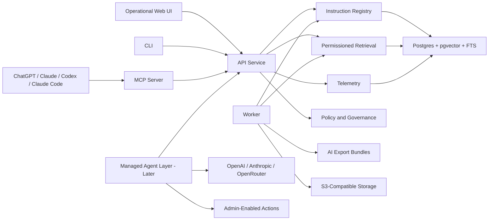

# Architecture

## Summary

Agentic CMS should be built as a containerized, API-first, agent-native platform. The registry, permissions, retrieval, validation, telemetry, and connector surfaces are core. The managed agent orchestration layer is designed from day one but implemented after the MVP proves the foundation.

## Component Model

## Core Services

### API Service

Owns auth, permissions, registry operations, retrieval, admin configuration, API keys, audit events, and public REST/OpenAPI contracts.

### Web UI

Operational interface for admins, maintainers, and fallback readers. It should prioritize dense management workflows over a marketing or publishing experience.

### CLI

Thin client over the public API for import, validation, publishing, search, export, and admin operations.

### MCP Server

First-class agent surface for search, fetch, explain, list capabilities, inspect citations, and later execute approved actions.

### Worker

Runs ingestion, chunking, embedding, export generation, stale checks, link checks, telemetry processing, and later eval jobs.

### Postgres

Initial system of record for users, tenants, registry objects, versions, permissions, telemetry, audit events, search documents, and vector embeddings.

### Object Storage

S3-compatible adapter for attachments, generated exports, large logs, and import artifacts.

## Data Model Direction

Keep human docs and agent instructions separate but linkable.

Core objects:

- tenant
- user
- group
- api key
- project/workspace
- asset
- asset version
- instruction object
- human document
- policy
- playbook
- tool instruction
- skill
- SOP
- template
- attachment
- chunk
- permission grant
- export package
- retrieval event
- answer/action event
- audit event

Every governed asset should have:

- stable ID
- type
- owner
- lifecycle state
- sensitivity
- audience
- source
- status
- review date
- allowed surfaces
- allowed exports
- allowed actions
- version
- citations/source references

## Search And Retrieval

Start with Postgres full-text search plus `pgvector` because it keeps the MVP deployable and permission-aware without adding a separate search service.

The current lexical scorer is transparent and tenant-tunable: admins can adjust source-kind weights and exact-phrase boost while preserving the shared `lexical-weighted-v1` ranking contract.

Add a search-service adapter later if real usage proves the need for:

- typo tolerance
- faceted browsing at higher scale
- lower-latency lexical search
- advanced ranking controls

Permission checks must happen before retrieval results are returned to API, CLI, MCP, exports, or model context.

## Managed Agent Layer

The full orchestration layer is not MVP, but interfaces must anticipate it. The current managed-query path includes a narrow provider-routed execution mode with deterministic fallback.

Future capabilities:

- provider adapter hardening, health checks, and fallback chains
- admin-controlled prompt and harness templates
- model routing rules
- answer caching
- citation checks
- policy compliance checks
- task completion and outcome acceptance checks
- escalation rules
- tool/action execution controls
- cost, rate, and budget policies
- response feedback loops

## Action Execution

Actions should be an extension framework.

Initial action types:

- HTTP/OpenAPI action
- MCP tool bridge
- Git/repo action
- document/source connector action
- local command action for trusted self-host installs only

Actions must be disabled by default and admin-enabled per tool with scopes, dry-run mode, approval mode, audit logs, rate limits, and kill switches.

Current implementation starts with a tenant-scoped hourly request cap on `/agent/actions/execute`, enforced before durable action request storage so runaway scoped agents cannot flood the approval queue.

## Deployment Options

### Option A: Docker Compose Canonical OSS Install

Components: API, web, worker, Postgres, Redis or queue, object storage adapter, optional search service.

Pros:

- easiest self-host story
- portable across local machines and VPS hosts
- clear open-source boundary
- good for individual power users and SMB pilots

Cons:

- operator owns backups, upgrades, TLS, and monitoring
- local secrets and storage need careful documentation

Recommendation: default OSS path.

### Option B: PaaS Container Deployment

Use the same containers on Railway, Render, Fly.io, or similar.

Pros:

- faster hosted-service path
- lower ops burden than Kubernetes
- good fit for early SMB production

Cons:

- platform-specific cost and limits
- managed Postgres/search/storage choices may vary
- needs deployment adapters and runbooks

Recommendation: first hosted/open-core path after Docker Compose.

### Option C: Kubernetes

Pros:

- enterprise deployment compatibility
- stronger isolation and scaling controls
- standard path for larger organizations

Cons:

- too much operational burden for MVP
- slower iteration
- harder for individual users

Recommendation: later enterprise target only.

## Recommended Architecture Decision

Build the core as a TypeScript monorepo with containerized services, Postgres, and adapter boundaries for auth, model providers, storage, search, and action execution.

This gives the project a real open-source core while preserving hosted-service upside.
