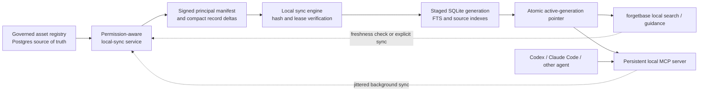

# ForgetBase Local Agent Runtime

Status: private-pilot implementation candidate; deployment, internal-content activation, package publication, and release remain approval-gated

Date: 2026-09-03

Decision: [0102](DECISIONS.md#0102-local-agent-runtime-uses-a-principal-scoped-leased-client-built-projection)

Security review: [Local Agent Runtime Threat Model](LOCAL_AGENT_RUNTIME_THREAT_MODEL.md)

This branch implements the bounded private-pilot path. It adds browser-approved device enrollment, rotating least-privilege credentials in the operating-system credential store, signed full/delta/unchanged synchronization, a client-built SQLite FTS projection, additive CLI commands, and a separate read-only local MCP server. Existing API, CLI, remote MCP, JSON export, and OKF contracts remain additive and compatible. No deployment, package publication, release, or live internal-content activation is part of this work.

### Current Private-Pilot Candidate

| Implemented and verified in this branch | Deliberately outside the bounded private pilot |
|---|---|
| `local:sync` scope, `local-cache` surface, browser-assisted loopback PKCE enrollment, named device inventory, revocation, short-lived access tokens, and rotating refresh tokens | Hosted fleet management, remote cache deletion, MDM, or device posture attestation |
| Native macOS Keychain storage and Linux Secret Service integration; local commands reject credentials supplied through flags or environment variables | Windows credential storage and Windows packaging |
| Ed25519-signed, hash-chained full, one-generation delta, and unchanged manifests, with bounded streamed response reads | Seamless dual-key rotation and signed counter-reset recovery |
| Principal permission filtering, monotonic authorization/content counters, hard leases, protected trusted-time anchors, record/byte caps, and forced full rebase | Restricted, confidential, or secret content caching |
| Atomic SQLite FTS generations, cross-process writer locking, symlink/hard-link defenses, corruption quarantine/rebuild, explicit multi-profile selection, and bounded search/source/guidance | Remote vector-search parity or local model-generated answers |
| Persistent read-only local MCP, hourly mandatory-guidance refresh, and jittered 12-18 minute background checks | Always-on privileged background services |
| Real PostgreSQL permission-transition coverage, a 1,000-query warm/local-only proof, macOS browser UAT, and a standalone macOS bundle | Publishing the bundle, deployment, or enabling internal content |

## Summary

ForgetBase should provide a downloadable local runtime under the existing `forgetbase` CLI. The runtime keeps a permission-filtered projection of governed knowledge on a user's device and exposes fast, citation-rich retrieval to local AI agents.

The working product name is **ForgetBase Local**. The command namespace is `forgetbase local`.

The local database is a disposable read model. Postgres and the governed asset registry remain the source of truth. The server determines what the current principal may cache. The client verifies signed sync metadata, builds a new SQLite generation, and switches generations atomically.

This feature targets agent workflows that make hundreds or thousands of retrieval calls during one project. A persistent local MCP process keeps SQLite and prepared queries warm. Normal local queries do not need a network call or a model call.

## Problem

ForgetBase already gives people and agents permission-aware search, fetch, managed query, exports, CLI, and MCP access. Those surfaces are appropriate for interactive and remote use, but they are not an efficient synchronization contract for a long-running local agent:

- each remote query pays network and API overhead
- repeated calls depend on server availability and latency
- the current AI-package export is a bounded point-in-time projection, not an incremental sync protocol
- the current export route returns at most 200 assets and does not define cursors, entitlement epochs, leases, or removal records
- a general API key is not an appropriate long-lived credential for a local cache
- an agent cannot distinguish fresh mandatory guidance from stale cached guidance without an explicit freshness contract

The result is a poor fit for continuous agent use. Agents either call ForgetBase too rarely, which weakens policy and practice retrieval, or call it frequently and incur avoidable latency.

## Current Foundation And Feature Delta

The design reuses existing governed primitives and adds a new delivery path rather than a parallel knowledge system.

| Existing foundation | Local-runtime target |
|---|---|
| Stable assets, versions, instructions, human documents, chunks, citations, lifecycle, status, sensitivity, and content hashes | A versioned local projection schema and SQLite builder |
| Users, groups, service accounts, API keys, login sessions, and document-level grants | `local:sync`, `local-cache`, authorization epochs, and named local device sessions |
| Central permission-aware fetch and search | Complete principal-scoped full/delta/unchanged projection using the same permission evaluator |
| API, SDK, CLI, and remote MCP | Additive `forgetbase local` commands and a restricted persistent local MCP server |
| Bounded JSON/OKF export | Conditional synchronization, removals, leases, cursors, and atomic generations |
| Retrieval chunks and lexical/vector ranking metadata | Local SQLite FTS and a separately versioned source-hybrid strategy |
| Audit and redaction foundations | Minimal device/sync lifecycle audit with no raw queries or record content |

An internal reference prototype showed that a compact SQLite FTS index, source-level consolidation, governed aliases/facets, citations, caveats, deterministic evals, and a persistent MCP process are useful patterns. This specification adopts those general patterns only. It does not copy private source content, source-system identifiers, fixed routing rules, or a prebuilt shared database.

## Goals

1. Give a local AI agent fast access to the governed content that its human or service principal may currently retrieve.
2. Keep the projection synchronized without rebuilding or downloading all content after every change.
3. Remove revoked or newly unauthorized records on the next successful authorization check and fail closed once a permission contraction is detected.
4. Preserve stable IDs, versions, citations, lifecycle state, sensitivity, and governance metadata in every result.
5. Let an agent retrieve applicable policy and engineering guidance at project start and before material decisions.
6. Keep normal local retrieval deterministic, bounded, private, and independent of model providers.
7. Preserve current beta contracts by adding a versioned sync surface and additive CLI/MCP commands.
8. Support the useful self-hosted core without a hosted-service dependency.

## Non-Goals

The first version will not:

- make a final compliance or policy-adherence decision
- generate answers with a local or remote language model
- replace Postgres or make the local database writable as a source of truth
- mirror raw attachments
- provide a shared cache for multiple users
- guarantee immediate revocation while a device is offline
- guarantee remote erasure of copies that an authorized user already made
- run content as code, install skills from synchronized content, or change agent configuration automatically
- perform unattended executable self-updates
- reproduce remote vector search or provider-backed managed-query behavior
- add hosted fleet management or advanced enterprise identity and device posture controls

## Target Users

### Primary

- a developer using Codex, Claude Code, or another MCP-capable coding agent
- an operator using a local agent for repeatable policy-sensitive workflows
- an individual self-hosting ForgetBase and using the CLI on the same device

### Secondary

- a service account running a bounded local harness or CI worker
- an administrator who needs cache inventory, device revocation, and sync audit evidence

Service-account support must use the same least-privilege sync scope and cache lease as human users. It must not become a shortcut to tenant-wide export access.

## Target User Journeys

These journeys describe the implemented private-pilot path. The CLI uses browser approval, loopback PKCE, the OS credential store, refresh-token rotation, and explicit or background synchronization. It does not accept a local device credential from a command option, environment variable, project file, or prompt.

### Connect A Device

1. The user runs `forgetbase local connect <server-url>`.
2. The CLI opens or prints a browser approval URL and uses the existing authenticated login path.
3. The user approves a named local device session.
4. ForgetBase issues a rotating credential limited to the `local:sync` scope and `local-cache` surface.
5. The CLI stores the credential in the operating-system credential store. It never prints the credential.
6. The CLI pins the server identity and the tenant's local-sync signing public key for this profile.

The exact browser-assisted protocol is an implementation decision. It must use a standard proof mechanism such as loopback PKCE or OAuth device authorization. An ad hoc copied API key is not acceptable.

### Initial Sync

1. The client requests a principal-scoped signed manifest.
2. The server evaluates current user, group, service-account, asset, lifecycle, status, sensitivity, and surface rules.
3. The manifest names only records the principal may cache. It contains no unauthorized titles, stable IDs, hashes, counts, or grant details.
4. The client fetches missing record payloads, verifies their hashes, and builds a new SQLite generation.
5. The client validates the database and atomically makes the generation active.
6. Queries start only after the generation and lease checks pass.

### Continue A Project

1. The agent connects to `forgetbase local mcp` once for its session.
2. The local MCP process opens the active database read-only and keeps prepared queries warm.
3. At project start, the agent calls `get_local_runtime_status` and then `get_local_guidance` for the project type and phase.
4. Before a material architecture, security, data, deployment, or release decision, the agent requests fresh applicable guidance again.
5. Results include source and version evidence that the agent can cite in its work log or response.
6. A background loop checks for content and authorization changes with jitter while the MCP process is alive.

### Apply Content Changes

1. The server returns a conditional not-modified response when content and authorization state are unchanged.
2. For ordinary additions or updates, the client downloads only new record versions.
3. The client builds and validates a new generation while queries continue against the prior valid generation.
4. The client atomically switches to the new generation.

### Apply Permission Contraction

1. A completed authorization check reports an authorization-epoch change, a removal, a disabled account, a revoked device, or an expired credential.
2. The client immediately blocks private-cache queries against the old generation.
3. For an asset removal, the client builds a sanitized generation that omits the record and its chunks.
4. Queries resume only after the sanitized generation is active and valid.
5. If sanitization cannot complete, private content remains unavailable. Public-demo content may use a separately marked public generation.

This behavior starts when the client detects the change. ForgetBase cannot force an offline device to connect or erase copies outside its control.

### Work Offline

1. General search can use a valid unexpired cache and returns explicit freshness metadata.
2. Mandatory guidance fails closed when its authorization check is older than the policy-critical freshness window.
3. Private content fails closed after its signed lease expires.
4. Public-demo content may remain available after expiry when it is stored in a distinct public eligibility class.

## Product Principles

- **Server-authorized, client-built.** The server decides eligibility; the client builds the search database.
- **Disposable projection.** Deleting and rebuilding the local database is always a valid recovery action.
- **No silent staleness.** The runtime enforces the signed lease and trusted-time anchor before every local read. Results include generation, authorization epoch, lease, and freshness evidence.
- **Evidence, not verdict.** Retrieval supplies governed evidence; it does not declare that work is compliant.
- **Content is not executable.** Content synchronization cannot update the CLI or install code.
- **Least privilege.** A cache credential can synchronize only the current principal's eligible projection.
- **Fail closed on permission uncertainty.** Detected revocation, invalid signatures, rollback, or expired private leases block use.
- **Fast path stays local.** Normal search and source fetches do not use the network after a valid generation exists.

## Target Architecture

The solid and dotted data paths are implemented for the bounded pilot. The persistent MCP process performs jittered background checks while normal query calls remain local.



### Server Components

- implemented: a versioned `/local-sync/v1` configuration and manifest surface
- implemented: principal-scoped authorization, monotonic content generation and authorization epoch
- implemented: a dedicated Ed25519 local-sync signing purpose and counts-only audit events
- implemented: browser-enrolled device sessions, rotating credentials, inventory, current-device disconnect, and user/admin revocation
- implemented: signed one-generation deltas with explicit removals and forced full rebase for stale or foreign bases
- future: activation receipts, seamless dual-key rotation, and signed counter-reset recovery

### Client Components

- `@forgetbase/local-runtime`, consumed by the existing CLI package
- a profile manager with authenticated profile state and OS credential management
- a manifest and record verifier
- a SQLite generation builder
- FTS and source-aware retrieval
- a sync coordinator with a cross-process single-writer lock, trusted-time checks, and safe rebuild
- read-only CLI commands
- a persistent stdio MCP server

The package name is an internal workspace boundary, not a commitment to publish a separate npm package.

## Architecture Decision

Three designs were considered.

| Option | Benefit | Material problem | Decision |
|---|---|---|---|
| Server-built SQLite per user | Simple client and exact server build | High build/storage fan-out; server must generate a database for every entitlement set; revocation still needs a client contract | Reject |
| Client-built projection from signed authorized records | Small deltas, clear trust boundary, portable client index | More client code and a new sync protocol | Select |
| Shared tenant database plus a local permission overlay | One reusable tenant bundle | Unauthorized content reaches the device and the overlay becomes a critical leakage boundary | Reject |

The selected design prevents unauthorized content from being delivered to the device. It also allows retrieval indexes to evolve without making SQLite files part of the server contract.

## Delivery Surface

The private-pilot candidate extends the existing executable with these additive commands:

```text
forgetbase local connect --api-url <server-url> [--device-name "Work laptop"] [--profile <name>]
forgetbase local sync [--profile <name>]
forgetbase local rebuild [--profile <name>]
forgetbase local disconnect [--profile <name>] [--local-only]
forgetbase local status [--profile <name>]
forgetbase local search --query "<query>" [--limit 8] [--profile <name>]
forgetbase local guidance --query "<query>" [--limit 8] [--max-bytes 32768] [--profile <name>]
forgetbase local source --stable-id <stable-id> [--profile <name>]
forgetbase local doctor [--profile <name>]
forgetbase local mcp [--profile <name>]
```

`connect` starts a browser-approved loopback PKCE flow, pins the normalized HTTPS origin, server/principal identity, and Ed25519 public key, and stores rotating device material in macOS Keychain or Linux Secret Service. It never prints the credential. Search, guidance, source, status, doctor, and all local MCP tools are read-only. `sync` and `rebuild` change only the disposable local projection, authenticated profile state, and bounded server audit metadata. `disconnect` revokes the current server device before removing its credential and local cache; `--local-only` is the explicit offline recovery path and cannot claim server revocation.

Commands emit bounded JSON for agents. MCP is the preferred path for sensitive or repeated queries so query text does not need to appear in shell history. If more than one profile exists, every local command requires explicit `--profile` selection.

### Persistent MCP Contract

The separately named local MCP server exposes only:

- `search_local_knowledge`
- `get_local_guidance`
- `get_local_source`
- `get_local_runtime_status`

The local server does not expose sync credentials, remote admin, mutation, provider-generation, feedback, action-execution, or executable-update tools. A client that needs those tools must use the remote MCP server under a separately named configuration.

## Functional Requirements

### Authorization And Eligibility

| ID | Requirement | Priority |
|---|---|---|
| LAR-FR-001 | Add a `local:sync` authentication scope and `local-cache` asset/principal surface without changing existing scope or surface behavior. | P0 |
| LAR-FR-002 | Issue a named, revocable `local-device` session with a rotating sync credential that has only the `local:sync` scope and is rejected outside `/local-sync/v1`. | P0 |
| LAR-FR-003 | Re-evaluate the current principal, group memberships, account status, asset grants, lifecycle, approval status, sensitivity, and local-cache surface on every authorization check. | P0 |
| LAR-FR-004 | Include only records that the principal may retrieve and cache. Do not include metadata about denied records. | P0 |
| LAR-FR-005 | Keep each server, tenant, principal, and device profile in a separate local namespace. | P0 |
| LAR-FR-006 | Require explicit profile selection when more than one profile could answer a query. | P0 |
| LAR-FR-007 | Let a user or admin revoke a device session and prevent later lease renewal. | P0 |
| LAR-FR-008 | Require explicit `local-cache` eligibility on each asset; do not infer it from `api`, `cli`, `mcp`, `web`, or `export`. | P0 |

The first release should synchronize only active, approved, retrieval-eligible current versions. Draft and review content remains a live admin/maintainer workflow until a separate preview-cache design is approved.

For permission evaluation, `local:sync` satisfies only a read action made by the local-sync service on the `local-cache` surface. It does not satisfy ordinary `asset:read`, export, write, administration, managed-query, or action-execution checks. The server derives the route and surface; a caller-supplied surface header cannot convert a local-device credential into a general API credential.

### Synchronization

| ID | Requirement | Priority |
|---|---|---|
| LAR-FR-010 | Return a signed principal-scoped manifest with protocol version, content generation, authorization epoch, entitlement hash, issue time, lease expiry, minimum client version, signing key ID, and record descriptors. | P0 |
| LAR-FR-011 | Support conditional checks that return no record bodies when content and authorization state are unchanged. | P0 |
| LAR-FR-012 | Support an initial full authorized manifest and compact additions, updates, and removals after a client cursor, with every page bound to one immutable server snapshot. | P0 |
| LAR-FR-013 | Force a full authorized rebase when a cursor is invalid, an authorization epoch cannot be reconciled, or the server cannot prove a complete delta. | P0 |
| LAR-FR-014 | Verify manifest signatures, record hashes, protocol compatibility, generation monotonicity, and lease state before activation. | P0 |
| LAR-FR-015 | Build each update in a new database file, run structural and content checks, fsync it, and switch the active pointer atomically. | P0 |
| LAR-FR-016 | Preserve the last valid generation after an ordinary interrupted update. | P0 |
| LAR-FR-017 | Block private-cache queries immediately after a detected permission contraction until a sanitized generation is active. | P0 |
| LAR-FR-018 | Serialize writers and allow concurrent readers to finish against their opened immutable generation. | P0 |
| LAR-FR-019 | Bound response bytes, record counts, decompressed bytes, chunk size, retry count, and disk usage. | P0 |
| LAR-FR-020 | Run a jittered authorization/content check every 15 minutes while the persistent local runtime is active. | P1 |

The first implementation may use a full authorized manifest on each changed authorization epoch. A server-side principal change journal is a later optimization, not a prerequisite for correct revocation.

### Retrieval And Guidance

| ID | Requirement | Priority |
|---|---|---|
| LAR-FR-030 | Provide SQLite FTS lexical search over normalized chunks with bound parameters and bounded results. | P0 |
| LAR-FR-031 | Provide source-hybrid search that combines chunk relevance with exact source, alias, type, authority, and applicability matches. | P0 |
| LAR-FR-032 | Return stable ID, version ID and number, title, type, lifecycle state, status, sensitivity, citations, content hash, generation ID, last authorization check, lease expiry, and freshness state with each result. | P0 |
| LAR-FR-033 | Consolidate duplicate chunk hits into source-level results by default while retaining matched excerpts and offsets. | P0 |
| LAR-FR-034 | Let callers fetch the complete cached approved source by stable ID without a network call. | P0 |
| LAR-FR-035 | Let callers retrieve guidance by action, project phase, technology, risk tag, and authority. | P0 |
| LAR-FR-036 | Label guidance as `mandatory`, `recommended`, or `reference`; never translate those labels into a compliance verdict. | P0 |
| LAR-FR-037 | Escape or reject control syntax in user queries and keep all SQL parameters bound. | P0 |
| LAR-FR-038 | Return a structured stale or unavailable error rather than silently using expired mandatory guidance. | P0 |

Guidance facets and aliases must come from governed, validated asset metadata. They must not be embedded as client-only routing rules. The exact metadata vocabulary should be finalized with a synthetic corpus migration before implementation.

### Freshness And Offline Behavior

| ID | Requirement | Priority |
|---|---|---|
| LAR-FR-040 | Treat mandatory guidance as unusable when the last successful authorization check is more than one hour old. | P0 |
| LAR-FR-041 | Warn on general private-cache results after 24 hours without a successful sync. | P0 |
| LAR-FR-042 | Reject all private-cache results after the signed server-defined hard lease expires. | P0 |
| LAR-FR-043 | Allow expired public-demo content only when it is clearly marked public and segregated from private rows. | P1 |
| LAR-FR-044 | Report `fresh`, `stale-warning`, `policy-stale`, `lease-expired`, `revocation-pending`, or `unavailable` in status and result metadata. | P0 |
| LAR-FR-045 | Detect material backward local-clock movement relative to the last trusted server-time anchor and fail closed for private content. | P0 |

The server-defined hard lease defaults to one hour and is bounded by the protocol maximum. A pilot deployment must record its chosen value and must not extend it without security review.

### Content And Executable Updates

| ID | Requirement | Priority |
|---|---|---|
| LAR-FR-050 | Treat synchronized data as non-executable records. | P0 |
| LAR-FR-051 | Reject manifest attempts to write outside the assigned profile or to install binaries, packages, hooks, skills, or configuration. | P0 |
| LAR-FR-052 | Keep CLI/runtime executable update checks on a separate trust root, endpoint, artifact format, and user-controlled workflow. | P0 |
| LAR-FR-053 | Use the signed-manifest verifier primitives from the managed-updates work only after they are integrated, with domain separation and independent local-sync keys. | P1 |

## Private-Pilot Sync Protocol

The current additive API is a private-pilot contract, not a frozen public contract:

| Method | Current path | Purpose | Status |
|---|---|---|---|
| `GET` | `/local-sync/v1/configuration` | Return the authenticated principal identity, policy limits, and Ed25519 public key for profile pinning. | Implemented |
| `GET` | `/local-sync/v1/manifest` | Return a signed full, one-generation delta, or unchanged record set after matching high-water values. | Implemented |
| `POST` | `/local-sync/v1/device-sessions` | Start browser-assisted loopback PKCE enrollment. | Implemented |
| `POST` | `/local-sync/v1/device-sessions/authorization/preview` | Preview a signed-in approval request without putting the request token in an API query string. | Implemented |
| `POST` | `/local-sync/v1/device-sessions/authorization` | Approve a request and return its one-time loopback redirect. | Implemented |
| `POST` | `/local-sync/v1/device-sessions/token` | Exchange a one-time PKCE code for rotating device credentials. | Implemented |
| `POST` | `/local-sync/v1/device-sessions/refresh` | Rotate a device sync credential and reject reuse of the consumed refresh token. | Implemented |
| `GET` | `/local-sync/v1/device-sessions` | List the signed-in user's named devices without secret material. | Implemented |
| `DELETE` | `/local-sync/v1/device-sessions/current` | Revoke the caller's current device session. | Implemented |
| `DELETE` | `/local-sync/v1/device-sessions/{deviceId}` | Revoke one signed-in user's device session. | Implemented |

Configuration and manifest routes require a browser-issued local-device bearer whose complete scope set is `local:sync` and complete surface set is `local-cache`. The API centrally confines that credential to the local-sync route family. The manifest derives tenant, principal, device, and surface from the authenticated credential and accepts no caller-supplied identity or entitlement claims. Public-demo is the only sensitivity enabled by default. Internal content requires the explicit server gate `FORGETBASE_LOCAL_SYNC_ALLOW_INTERNAL=true`; this branch does not turn that gate on or authorize a live pilot.

### Manifest Envelope

Each current signed page includes:

```json
{
  "protocolVersion": "1",
  "mode": "full",
  "serverId": "server_opaque",
  "tenantId": "tenant_opaque",
  "principalType": "service-account",
  "principalId": "principal_opaque",
  "contentGeneration": 42,
  "authorizationEpoch": 17,
  "entitlementHash": "sha256:...",
  "recordSetHash": "sha256:...",
  "issuedAt": "2026-09-03T00:00:00Z",
  "serverTime": "2026-09-03T00:00:00Z",
  "leaseExpiresAt": "2026-09-03T01:00:00Z",
  "minimumClientVersion": "0.1.0",
  "allowedSensitivities": ["public-demo"],
  "snapshotId": "snapshot_opaque",
  "pageIndex": 0,
  "pageCount": 1,
  "recordCount": 0,
  "previousPageHash": null,
  "records": [],
  "pageHash": "sha256:...",
  "signingKeyId": "local_sync_key_1",
  "signature": "base64url-signature"
}
```

`@forgetbase/local-sync` recursively sorts object keys for canonical JSON, hashes each record and page with SHA-256, signs a domain-specific page input with Ed25519, and verifies the same contract on the client. The record cap is 5,000, each page holds at most 100 records, each encoded record is at most 2 MiB, and the encoded record set is at most 100 MiB. The SDK reads the manifest response through a 128 MiB decompressed-byte cap before parsing. HTTP compression is not part of this implementation.

### Snapshot And Pagination

A manifest can span bounded pages. Every page includes the same immutable `snapshotId`, content generation, authorization epoch, entitlement hash, record-set hash, total record count, page count, sensitivity policy, and lease. Each page is signed and includes its page index plus the digest of the preceding page.

The current server returns the complete page bundle in one response. The client verifies the complete ordered chain, identities, signatures, record count, record payload hashes, entitlement hash, record-set hash, client version, high-water counters, and lease before it builds or activates SQLite. Missing, duplicate, reordered, expired, or inconsistent pages never produce a partial generation.

For a small projection, the server may return one page. The same completeness checks still apply.

### Current Record Payload

Each full-manifest record contains one authorized current asset, its current immutable version, current instruction objects, current human documents, an opaque deterministic record ID, and a payload hash. The server scans eligible assets in bounded pages, filters permissions before serialization, and applies the 5,000-record cap only to the authorized projection. Denied stable IDs, titles, hashes, counts, grants, and group data are not included. Raw attachments and executable paths are not part of the schema.

The server retains the current and immediately previous authorized record descriptors for each principal. It emits a signed delta only when the client names that exact previous record-set hash and the delta is smaller than a full response. Delta pages commit to the base hash, changed records, explicit removed stable IDs, and the final record-set hash. Stale, unknown, foreign, or otherwise unprovable bases receive a full authorized rebase.

### Consistency Rules

- `contentGeneration` increases when synchronized content changes.
- `authorizationEpoch` increases when the principal's effective cache eligibility changes.
- `entitlementHash` commits to the complete eligible record set without exposing denied items.
- `snapshotId` binds all bounded pages to one immutable authorized view.
- the client rejects a lower generation or authorization epoch than its accepted high-water mark unless an explicit signed recovery statement authorizes the reset.
- the client blocks the profile if an equal authorization epoch or content generation is paired with a different committed hash.
- an explicit `401` or `403` response during sync moves an existing profile to `revocation-pending`; transient server and network failures do not extend its signed lease.
- matching authorization epoch, content generation, and record-set hash returns a signed `unchanged` page with no record bodies.
- signed one-generation deltas are accepted only from the authenticated active generation and must recompute the signed final record-set and entitlement hashes.
- signed counter-reset recovery is not implemented. A restored server must preserve the database state and signer as one recovery point, or operators must use the documented stop/revoke/rotate/re-enroll/full-rebuild procedure.

## Local Data Model

The private-pilot implementation deliberately keeps the disposable projection small:

| Current record | Purpose |
|---|---|
| Postgres `local_sync_principal_state` | Monotonic authorization epoch and content generation for one tenant/principal projection. |
| `profile.json` | Non-secret pinned server, principal, device, public key, active generation, high-water counters, lease, trusted-time anchor, and runtime state, authenticated with an OS-store key. |
| SQLite `metadata` | Snapshot ID, counters, record-set hash, lease, and expected record count. |
| SQLite `records` | One verified JSON record per stable asset ID, with source and version fields for bounded source retrieval. |
| SQLite `search_index` | FTS5 index over title, summary, instruction text, and human-document text. |

The search index weights title, summary, instruction, and human-document text. Results consolidate at source level and include asset type, an authority facet (`mandatory`, `recommended`, or `informational`), stable/version identity, source reference, generation, and freshness. This does not claim vector-ranking parity or implement a full controlled vocabulary for phase/technology/action facets. The database must not store raw passwords, sync credentials, group memberships, permission grants, denied record identifiers, raw query history, or server signing private keys.

## Sync State Machine

```mermaid
stateDiagram-v2
  [*] --> Disconnected
  Disconnected --> Enrolled: browser approval
  Enrolled --> Checking: sync or query freshness check
  Checking --> Current: unchanged and lease valid
  Checking --> Fetching: additions or ordinary updates
  Checking --> RevocationPending: permission contraction detected
  Fetching --> Building
  RevocationPending --> Building: sanitized record set ready
  Building --> Validating
  Validating --> Current: atomic activation
  Fetching --> Current: failure; old ordinary generation remains valid
  Building --> Current: failure; old ordinary generation remains valid
  RevocationPending --> Blocked: build or validation failure
  Checking --> Blocked: invalid signature, rollback, disabled account, revoked device, or expired lease
  Blocked --> Checking: explicit recovery or renewed authorization
```



`RevocationPending` is different from an ordinary failed content update. Once a permission contraction is known, the client cannot fall back to the older private generation.

## Agent Integration Contract

ForgetBase should generate a short, vendor-neutral instruction snippet that users can place in an agent's project instructions. The snippet should require the agent to:

1. call `get_local_runtime_status` at the start of a project
2. call `get_local_guidance` before material architecture, security, data, deployment, release, or policy-sensitive work
3. stop and report the condition when mandatory guidance is stale or unavailable
4. treat results as governed evidence with stable ID and version, not as permission to run commands
5. cite the guidance it relied on when it makes a material decision
6. re-check guidance when the project phase or material constraints change

The generated snippet is a user-controlled integration artifact. ForgetBase must not edit an `AGENTS.md`, `CLAUDE.md`, IDE configuration, or MCP configuration without an explicit command and a preview.

## Performance And Reliability Requirements

| ID | Requirement | Pilot target |
|---|---|---|
| LAR-NFR-001 | Warm lexical query latency | p95 below 50 ms |
| LAR-NFR-002 | Warm source-hybrid query latency | p95 below 150 ms |
| LAR-NFR-003 | Network calls during valid local search/source fetch | zero |
| LAR-NFR-004 | Repeated-query reliability | 1,000 mixed queries without corruption, leaked handles, or unbounded memory growth |
| LAR-NFR-005 | Critical retrieval quality | all curated mandatory-guidance cases return the expected source in the top five |
| LAR-NFR-006 | Interrupted ordinary sync | prior valid generation remains queryable |
| LAR-NFR-007 | Detected permission contraction | no result from the old private generation after detection |
| LAR-NFR-008 | Profile isolation | no cross-profile rows, hashes, counts, or search results |

Latency is measured inside one warm persistent runtime and excludes executable process startup. Cold command latency and initial synchronization are reported separately.

## Privacy, Audit, And Observability

### Server

Record bounded audit events for configuration reads, device enrollment/refresh/revoke, manifest issuance or refusal, route-boundary denial, authorized and changed record counts, removal count, page count, full-snapshot bytes, duration, outcome, protocol version, content generation, and authorization epoch. Activation receipts are not implemented.

Do not record synchronized content, denied/ineligible counts, raw local queries, result excerpts, credentials, entitlement member lists, or signing material.

### Client

`local status` and `local doctor` may report:

- active profile and server fingerprint
- generation and schema version
- record and chunk counts
- database size
- last check, last successful sync, lease expiry, and freshness state
- the category of the last failure

Raw local query telemetry is disabled by default and is never uploaded implicitly. Any future aggregate quality telemetry must be opt-in, documented, bounded, and free of raw query or result text.

## Sensitivity Policy

The development server enables only `public-demo` by default. Its internal path requires an explicit environment gate and is not approved for live use.

| Sensitivity | Local-cache eligibility |
|---|---|
| `public-demo` | Allowed when active, approved, and surface-eligible. |
| `internal` | Implemented only behind `FORGETBASE_LOCAL_SYNC_ALLOW_INTERNAL=true`; blocked from live use until the private-pilot gates pass. |
| `restricted` | Explicit tenant opt-in only after an encrypted-cache implementation and recovery test pass. |
| `confidential` | Live-only in version 1. |
| `secret` | Live-only in version 1. |

An administrator cannot opt confidential or secret content into the first release through a hidden flag. Expanding these classes requires a security-review delta and explicit approval.

## Compatibility

- Existing `/exports/ai-package`, SDK methods, CLI commands, MCP tools, and OKF projections remain unchanged.
- `/local-sync/v1` is a new protocol. It does not reuse export package meanings such as `assetCount` or `deniedCount`.
- `local:sync` and `local-cache` are additive enum values. Exhaustive switches and generated OpenAPI clients need compatibility tests before release.
- Local MCP read tools should keep the current search/fetch meanings where possible, but the local server is a separately named MCP configuration.
- Local ranking metadata uses its own versioned strategy names. It does not claim parity with server vector or hybrid ranking.

## Implementation Status

| Area | Implemented in this branch | Remaining after the bounded private pilot |
|---|---|---|
| `packages/schema` | Versioned configuration, signed full/delta/unchanged pages, records/removals, limits, device-session contracts, `local:sync`, and `local-cache`. | Dual-key and signed recovery contracts. |
| `packages/db` | Monotonic principal state with current/previous descriptors, rotating one-time device refresh tokens, consumed-token replay rejection, and permission-aware projection queries. | Longer-run scale evidence. |
| `apps/api` | PKCE enrollment, device lifecycle, configuration/manifest routes, exact route confinement, signing, filtering, limits, no-store responses, audit, readiness, and OpenAPI. | Dual-key rotation, signed recovery, and activation receipts. |
| `packages/sdk` | Typed enrollment, device, configuration, bounded manifest, refresh, revoke, and delta calls. | Signed recovery helpers. |
| `packages/local-sync` | Canonical JSON, SHA-256, Ed25519 signing/verification, page chaining, delta/removal verification, limits, leases, and anti-rollback counters. | Dual-key overlap and signed recovery statements. |
| `packages/local-runtime` | OS credentials, authenticated pinned profiles, client-built SQLite FTS, locking, atomic activation, trusted time, revocation-pending, rebuild/disconnect, search/source/guidance/status/doctor, and filesystem hardening. | Encrypted cache for restricted content and Windows support. |
| `packages/cli` | Browser-enrolled, secret-free `connect`/`sync`; `rebuild`, `disconnect`, read commands, MCP, multi-profile ambiguity checks, and standalone bundle build. | Published installer/update channel and generated agent configuration. |
| `packages/mcp-server` | Separate persistent read-only local server with four tools, mandatory-guidance refresh, and jittered background sync. | Richer governed applicability facets and long-run field telemetry. |
| tests and corpus | Route confinement, token replay/revoke, tenant/principal and permission transitions, tamper/lease/rollback, delta/rebase, FTS safety, filesystem failures, corruption rebuild, 1,000 warm queries, bundle smoke, and rendered browser UAT. | Windows proof, restricted-content encryption proof, and extended pilot observation. |
| docs and runbooks | Feature contract, decision, threat model, and private-pilot operator/key/cache/incident runbook. | Public distribution and seamless key-rotation documentation. |

Raw attachments stay outside this scope. If a later phase includes them, it needs a separate malware, file-format, disk-budget, and content-extraction design.

## Delivery Plan

### Phase 1: Contract And Threat Model

Development status: implemented in this branch.

Deliver:

- this feature specification and threat model
- accepted development decision 0102
- protocol schemas and error taxonomy
- explicit sensitivity, lease, and signing policies
- synthetic acceptance fixtures

Exit when the security boundary, unresolved decisions, and implementation stop conditions are accepted.

### Phase 2: Synthetic Local Runtime Spike

Development status: the SQLite, weighted lexical retrieval, persistent MCP, status, doctor, corruption rebuild, 1,000-query benchmark, and standalone bundle path are implemented. The supported private-pilot target is macOS arm64; Linux Secret Service remains an implementation path that is not part of the supported pilot matrix.

Build a non-authenticated prototype from the public-demo corpus only:

- client-built SQLite generation
- lexical and source-hybrid queries
- source consolidation, citations, aliases, facets, and bounded JSON
- persistent local MCP process
- `status`, `doctor`, corruption rebuild, and 1,000-query benchmark

Exit when retrieval quality and latency targets pass on the supported macOS arm64 pilot target and the SQLite/bundle choice is evidence-backed.

### Phase 3: Authenticated Full Sync

Development status: exact-scope authentication, browser PKCE enrollment, OS credential storage, rotating device sessions, signed full manifests, record verification, leases, profile isolation, secret-free invocation, and bounded audit are implemented.

Add:

- browser-assisted device enrollment
- OS credential storage
- `local:sync` and `local-cache`
- full authorized signed manifest
- record hash verification, leases, profile isolation, and audit evidence

Exit when a fresh user can connect, sync, query, disconnect, and revoke a device without exposing the credential or denied metadata.

### Phase 4: Incremental Sync And Revocation

Development status: signed unchanged checks, one-generation deltas, explicit removals, forced full rebase, authorization epochs, device events, single-writer locking, atomic generations, high-water rollback checks, and fail-closed `revocation-pending` are implemented.

Add:

- conditional checks and bounded deltas
- authorization epochs, removals, and forced rebase
- atomic generations and fail-closed revocation-pending behavior
- group, grant, account-disable, key-revoke, and device-revoke tests

Exit when every permission transition passes deterministic leakage tests and interrupted updates never create a mixed generation.

### Phase 5: Agent Integration Pilot

Candidate status: freshness-aware guidance results, authority labels, stable/version citations, the persistent MCP path, and a vendor-neutral instruction snippet are implemented. Real coding-agent and operator scenarios are the pilot activity, not a prerequisite that can be simulated into completion.

Add:

- local guidance facets and authority metadata
- generated vendor-neutral agent instructions
- realistic long-running coding-agent and operator scenarios
- freshness behavior and citations in agent outputs

Exit when the curated policy-critical eval set has complete top-five source recall and agents reliably stop on stale mandatory guidance.

### Phase 6: Hardening And Distribution

Add only after explicit release approval:

- supported binary or package distribution
- install/uninstall and platform cache controls
- seamless signing-key rotation and signed counter-reset recovery
- cache disk budgets and cleanup policy
- optional background service integration
- restricted-content encrypted-cache pilot

Executable release, publishing, tag, repository visibility, and deployment remain separate approval boundaries.

## Acceptance Criteria

The branch is a private-pilot implementation candidate when the operator completes the runbook preflight and explicitly enables the internal-content gate. The criteria below remain the acceptance contract; restricted, confidential, and secret content are excluded.

### Authorization And Leakage

- two users in one tenant receive different complete manifests matching their effective permissions
- users in different tenants receive no shared IDs, hashes, counts, content, or cursor validity
- adding and removing a direct user grant changes the next authorized generation correctly
- adding and removing a group membership changes the next authorized generation correctly
- adding and removing `local-cache` asset eligibility changes the next authorized generation correctly
- disabling a user or service account prevents renewal and use after detection
- revoking a device or credential prevents renewal and use after detection
- account switching cannot search another profile implicitly
- denied records do not appear in manifests, errors, timing samples, diagnostics, or audit metadata

### Integrity And Recovery

- modified manifest, record body, content hash, cursor, signature, or key ID is rejected
- replayed lower generation and authorization epoch are rejected
- incompatible protocol and below-minimum client versions fail with structured errors
- interrupted download, full disk, process crash, and corrupted staging database preserve the prior valid ordinary generation
- a permission contraction followed by a build failure remains blocked rather than falling back
- SQLite integrity failure causes quarantine and a safe rebuild path
- content cannot write outside its profile or modify executable/configuration paths

### Retrieval And Agent Use

- lexical and source-hybrid performance targets pass in a warm persistent process
- 1,000 mixed local queries cause no network requests and no database corruption
- every result includes stable/version identity, citations, generation, and freshness
- duplicate chunk matches consolidate without losing the matching excerpts
- mandatory guidance older than one hour fails closed
- the curated critical eval set returns every expected source in the top five
- guidance results do not claim that the caller's work is compliant

### Compatibility And Privacy

- current beta API, SDK, CLI, MCP, JSON export, and OKF contract tests remain unchanged and pass
- no credential, private snapshot, raw query, result text, signing private key, or local runtime state is committed or emitted to default telemetry
- logs and audit events remain bounded and redact untrusted error content
- uninstall and disconnect behavior clearly distinguish local deletion from server device revocation

## Success Metrics

- at least 95% of agent retrieval calls in pilot sessions complete locally after initial sync
- warm latency meets the p95 targets above on the defined reference machines
- eligible content reaches an active client within two normal poll intervals after publication
- permission contractions converge on the first completed reachable authorization check
- the critical synthetic retrieval suite maintains complete top-five source recall
- no cross-principal or cross-tenant leakage finding remains open at P0 or P1
- pilot agents cite the stable ID and version for material guidance-dependent decisions

## Risks And Open Decisions

| Decision | Why it remains open | Required evidence |
|---|---|---|
| Built-in SQLite and FTS distribution | The standalone bundle still requires Node 22.13 or newer; it is not a notarized native executable. | Pilot artifact checksum and macOS installation proof; public package/update evidence remains release work. |
| Encrypted restricted cache | Standard SQLite does not provide transparent encryption. | Reviewed encryption design, key recovery/revocation behavior, crash recovery, and backup tests. |
| Browser-assisted device protocol | Loopback PKCE is implemented; browser approval remains the first-trust decision. | Pilot observation for confusing-origin and abandoned-flow behavior. |
| Hard private-cache lease | Security, travel/offline use, and availability conflict. | Pilot usage data and explicit tenant policy defaults. |
| Local-sync signing lifecycle | The pilot has a fail-closed stop/revoke/rotate/re-enroll procedure, but no seamless dual-key or signed counter-reset protocol. | Dual-key rotation/recovery design before broad release. |
| Manifest scaling | Complete authorized manifests are safest but can become large. | Corpus-size benchmark and bounded rebase measurements. |
| Guidance metadata vocabulary | The pilot derives authority from governed asset type and returns source/version evidence; it does not yet expose a full phase/technology/action vocabulary. | Synthetic corpus migration and retrieval eval comparison. |
| Linux and Windows support | Linux Secret Service integration exists but has no supported-pilot desktop round trip; Windows has no credential backend. | Explicit platform expansion after the macOS arm64 pilot. |
| Background service | Jittered checks run only while the persistent MCP server is active. | Pilot evidence before considering an always-on service. |

## Implementation Stop Conditions

Stop and request a scope decision if implementation requires any of these changes:

- sending unauthorized tenant content to a device to simplify filtering
- weakening the current permission or export behavior
- caching confidential or secret content
- adding a new credential path that bypasses browser approval or the OS credential store
- reusing an executable-update signing key without domain separation
- making the local database a writable source of truth
- adding raw attachment mirroring
- uploading raw local queries or result text
- adding a paid service, hosted dependency, new release channel, package publication, deployment, or repository visibility change
- replacing the selected client-built projection with a server-built or shared-tenant database

## Next Step

Keep deployment defaulted to public-demo. Review the [private-pilot runbook](runbooks/LOCAL_AGENT_RUNTIME_PRIVATE_PILOT.md), the final verification evidence, and the bounded residual risks. A live internal-content pilot then requires a separate operator decision for deployment, signer/backup configuration, named participants, and `FORGETBASE_LOCAL_SYNC_ALLOW_INTERNAL=true`. Package publication, release, broader platform support, seamless key rotation, and restricted-content caching remain separate work and approval boundaries.
