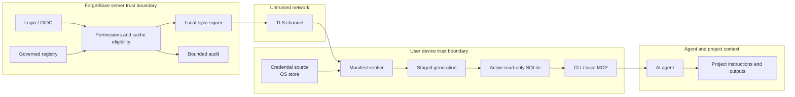

# Local Agent Runtime Threat Model

Status: private-pilot candidate security baseline; live activation remains approval-gated

Date: 2026-09-03

Feature specification: [ForgetBase Local Agent Runtime](LOCAL_AGENT_RUNTIME.md)

This review covers the local synchronization, cache, CLI, and MCP boundary. The feature branch contains the bounded controls required for a macOS arm64 internal-content pilot. It still defaults to public-demo content. A live pilot requires the operator preflight and a separate decision to enable internal content.

## Threat Model Summary

ForgetBase Local creates a new trust boundary. Permission-filtered governed content leaves the server and persists on a user-controlled device so local agents can query it with low latency.

The server remains authoritative for identity, permissions, eligibility, content versions, and leases. The client receives only the current principal's eligible records, verifies a signed manifest and content hashes, builds an immutable SQLite generation, and rejects use when integrity or freshness checks fail.

The design can provide bounded revocation convergence. It cannot provide immediate revocation while a device is offline, remote erasure of copied content, or protection from an attacker who fully controls an unlocked user session and the running client.

The highest-risk failures are:

- cross-principal or cross-tenant content delivery
- use of content after a detected permission contraction
- a long-lived or overprivileged local credential
- manifest rollback, tampering, or signing-key compromise
- treating synchronized content as executable code or authoritative system instructions
- unencrypted private data in device backups or another local account's reach

A live private-content pilot must not begin until the applicable P0 and P1 checks in this document and the operator runbook pass for the exact deployment. The internal-content code path remains disabled by default and is not activated by this branch.

### Current Private-Pilot Boundary

| Present and verified in this branch | Residual boundary |
|---|---|
| Browser-approved loopback PKCE, rotating one-time refresh credentials, consumed-token replay rejection, named devices, user/admin revocation, exact `local:sync`/`local-cache` scope, and central rejection outside `/local-sync/v1` | First approval is a trust-on-first-use decision; a same-user attacker remains outside the protection boundary |
| Native macOS Keychain storage, stdin-only native helper secret transfer, authenticated profile state, and rejection of credential flags/environment variables | Linux is not in the supported pilot matrix; Windows is unsupported |
| Bounded eligible-asset scanning, permission filtering before serialization, authorized-only caps, public-demo default, and no denied/ineligible audit counts | Timing non-interference is bounded, not formally constant-time |
| Ed25519 signatures, page chain, record hashes, full/delta/unchanged modes, leases, protected trusted-time state, high-water counters, and size limits | No seamless dual-key transition or signed counter-reset recovery |
| Client-generated filenames, `0700` directories, `0600` files, single-writer lock, symlink/hard-link rejection, staging, integrity/count checks, fsync, atomic activation, and quarantine/rebuild | Secure erase and remote deletion from snapshots or backups are not guaranteed |
| Result freshness/provenance, mandatory-guidance refresh, 1,000 warm local-only queries, permission-transition tests, standalone bundle smoke, and rendered browser UAT | Pilot devices must use FileVault and follow the backup/cache runbook |

## Scope

### In Scope

- browser-assisted local device enrollment
- local-sync credential issuance, storage, rotation, expiry, and revocation
- principal-scoped manifests, cursors, records, and removals
- authorization and content epochs
- signed metadata and content-hash verification
- local profile directories and immutable SQLite generations
- CLI and persistent stdio MCP query surfaces
- freshness, offline use, lease expiry, and account switching
- local logs, diagnostics, server audit events, and optional future aggregate telemetry
- content/executable update separation
- cache deletion, disconnect, and incident response

### Out Of Scope

- protection after an attacker gains full control of the ForgetBase server
- digital-rights management after an authorized user deliberately copies content
- guaranteed secure erase from SSDs, snapshots, backups, or forensic media
- raw attachment caching
- confidential or secret content caching in version 1
- hosted fleet management, MDM, remote attestation, and device posture enforcement
- provider-backed answer generation
- side-effecting agent actions
- executable self-update implementation

These exclusions are limits, not evidence that the related risks are low.

## Security Properties

The design must preserve these properties:

1. **Confidentiality:** a device receives only content that its authenticated principal may cache at issuance time.
2. **Tenant isolation:** no identifier, hash, count, content, cursor, or timing artifact crosses a tenant boundary.
3. **Principal isolation:** local profiles and server projections cannot be queried across users, service accounts, or devices by accident.
4. **Integrity:** the client activates only records committed by a valid signed manifest and matching content hashes.
5. **Freshness:** every query can establish the active generation, last authorization check, and lease state.
6. **Revocation convergence:** after the client detects a permission contraction, it cannot use the old private generation.
7. **Least privilege:** the device credential can synchronize one principal's eligible projection and cannot administer, write, export broadly, or execute actions.
8. **Non-execution:** synchronized content cannot install or replace code, hooks, skills, agent configuration, or the CLI.
9. **Privacy:** raw local queries and result text do not leave the device by default.
10. **Recoverability:** ordinary partial updates cannot corrupt or replace the last valid generation.

## Protected Assets

| Asset | Security need |
|---|---|
| Governed instruction and document content | Confidentiality, integrity, correct version, provenance |
| Stable IDs, titles, hashes, counts, citations, and metadata | Confidentiality where they reveal restricted knowledge |
| Tenant, principal, group, grant, and eligibility state | Confidentiality and correct authorization |
| Device sync credential and refresh material | Confidentiality, expiry, rotation, revocation |
| Local-sync signing private key | Strong confidentiality and controlled use |
| Pinned signing public keys and server identity | Integrity and rollback resistance |
| Manifest, cursors, epochs, leases, and trusted-time anchor | Integrity, freshness, anti-replay |
| SQLite generation and active pointer | Confidentiality, integrity, crash consistency |
| Agent result envelope and citations | Integrity, clear data/instruction separation |
| Local diagnostics and server audit metadata | Confidentiality, minimization, integrity |
| Executable update trust root | Isolation from synchronized content and local-sync keys |

## Actors And Capabilities

### Legitimate Actors

- **Reader or maintainer:** connects a personal device and searches content they may retrieve.
- **Service account operator:** runs a bounded local harness with a service principal.
- **Tenant admin:** configures local-cache eligibility, reviews devices, and revokes sessions.
- **Self-hosted operator:** controls deployment keys, backups, TLS, and runtime policy.
- **Local AI agent:** sends queries and consumes structured results through CLI or MCP.

### Threat Actors

- **Unauthorized tenant user:** has a valid account but lacks access to target content.
- **Cross-tenant attacker:** tries to influence tenant or principal identifiers.
- **Network attacker:** can observe, delay, replay, or modify traffic but does not control valid TLS or signing keys.
- **Stolen-device attacker:** gets filesystem access or an unlocked user session.
- **Malicious local process:** runs as the same OS user and can read that user's files or invoke the CLI.
- **Malicious or compromised knowledge author:** places prompt injection, misleading instructions, or hostile data in governed content.
- **Compromised server or signer:** can authorize or sign malicious content.
- **Resource-exhaustion attacker:** sends oversized, compressed, malformed, or high-cardinality data.
- **Accidental operator:** misconfigures sensitivity, cache policy, key rotation, lease duration, or profile selection.

## Trust Boundaries

Important boundary rules:

- TLS authenticates the server transport. The signed manifest authenticates the sync statement and supports offline verification.
- Target enrollment is the trust-on-first-approval point for the server identity and local-sync public key. The browser approval shows the normalized server and loopback callback before the CLI pins the origin, server ID, and key.
- The operating-system user boundary is not a sandbox. A same-user malicious process may be able to read the cache or invoke the runtime.
- The agent context is a separate trust boundary. Returned content is data with provenance, not a system message or executable instruction.

## Assumptions

- Deployments use HTTPS outside loopback-only local development.
- The server permission model is authoritative and denies by default.
- The pilot device is macOS arm64, has a usable Keychain, and uses restrictive file permissions.
- FileVault is enabled for every device that caches internal content.
- The local executable and its dependencies are obtained through an independently verified distribution path.
- The client authenticates its profile state with a Keychain-held key and keeps its counter and trusted-time high-water marks in that authenticated profile.
- Server clocks are reliable enough to issue bounded leases.
- A fully compromised unlocked user account can bypass client policy; the design limits accidental exposure and offline theft but cannot defend against arbitrary same-user code execution.
- An authorized user can copy visible content. ForgetBase does not claim DRM.

## Severity Model

- **P0 Critical:** likely cross-tenant/principal disclosure, privilege escalation, signing-key compromise, or content-to-code execution. Blocks all pilot use.
- **P1 High:** material private-data exposure, bypass of revocation/freshness controls, credential theft, or durable integrity failure. Blocks the affected sensitivity class.
- **P2 Medium:** bounded availability, privacy, diagnostic, or misuse risk with no direct permission bypass. Must have an owner or accepted residual risk.
- **P3 Low:** defense-in-depth or usability issue with limited security effect.

## Findings

### P0 Critical

| ID | Threat | Attack or failure path | Required mitigation | Verification |
|---|---|---|---|---|
| LAR-TM-001 | Cross-tenant or cross-principal manifest leakage | The client supplies a tenant/principal ID, a cache query omits tenant scope, or a shared manifest is reused. | Derive tenant and principal only from the authenticated dedicated credential. Scope every repository query to tenant and principal; scope future cursors to tenant, principal, device, and authorization epoch. Return no denied metadata. | Two-tenant and two-principal differential tests compare bodies, IDs, hashes, counts, errors, and future cursors. Fuzz caller-supplied IDs. |
| LAR-TM-002 | Old private generation remains usable after detected revocation | The client learns that a grant, group, account, key, or device changed but keeps answering from the old database while rebuilding or after a failure. | Enter `revocation-pending` before returning another private result. Invalidate the old private generation logically. Resume only after an authorized sanitized generation activates. | Inject every permission contraction during active queries and crash/fail each build stage. Assert zero old private results after detection. |
| LAR-TM-003 | Local credential becomes an admin or broad export credential | Enrollment reuses a login/API key or maps cache access to the existing export action. | Issue only browser-approved `local-device` credentials with exact `local:sync` and `local-cache` bindings. Centrally reject them outside `/local-sync/v1` and continue to evaluate the principal's document grants inside the route. | Route matrix tests invoke every API family with the sync credential, spoof surface headers, and require denial outside local-sync. |
| LAR-TM-004 | Synchronized content installs or replaces executable code | A manifest supplies a path, package, hook, skill, config edit, or executable update. | Records have typed opaque IDs, not filesystem paths. The builder writes only its newly created profile generation. Content sync cannot invoke package managers, modify agent config, or touch the executable update trust root. | Malicious path, symlink, archive, hook, package, and config payload tests; filesystem allowlist assertions. |
| LAR-TM-005 | Signing-key compromise permits arbitrary authorized-looking projections | An attacker steals the local-sync private key or the deployment shares it with a broader release key. | Use a dedicated 0600 regular-file key, protected deployment storage, unique key ID, backup, audit, and the pilot stop/revoke/rotate/re-enroll procedure. Never reuse executable release keys. Seamless dual-key transition is release work. | Startup rejects unsafe/symlink key files; pilot preflight checks key backup and incident procedure. Dual-key overlap remains unproved and outside the pilot claim. |

### P1 High

| ID | Threat | Attack or failure path | Required mitigation | Verification |
|---|---|---|---|---|
| LAR-TM-010 | Offline cache remains usable after unseen revocation | A device disconnects before the server changes permissions. | Enforce signed leases before every local read, refresh mandatory guidance after one hour, show freshness on every result, and state the offline limitation clearly. | Simulated expiry, stale mandatory guidance, grant removal, account disable, and device revoke. |
| LAR-TM-011 | Manifest rollback or replay | A valid older response restores deleted content or extends stale access. | Authenticate accepted generation, authorization epoch, signing key ID, and trusted-time anchor with an OS-store key; reject lower counters, clock rollback, and expired leases. A legitimate counter reset requires the documented stop/re-enroll path because signed recovery is not implemented. | Replay old manifests and signed leases, change the local clock, tamper with the profile, and restore an old profile backup. |
| LAR-TM-012 | Record or database tampering | A local or network attacker changes record content, FTS rows, citations, or the active pointer. | Verify manifest signature and every payload hash before build. Store generation checksum metadata. Open active SQLite read-only, run integrity/schema checks, and quarantine any mismatch. | Modify each record field, FTS row, database page, pointer, and checksum. Require quarantine/rebuild. |
| LAR-TM-013 | Credential theft | A raw token appears in stdout, shell history, config, logs, crash reports, or repository files. | Require browser-assisted enrollment, OS credential storage, short-lived access material, rotating refresh material, no token preview, bounded redacted errors, and no credential CLI flag or environment path. | Capture process arguments, environment, stdout/stderr/logs, inspect config/cache files, scan test worktrees, and exercise refresh/revoke. |
| LAR-TM-014 | Local cache theft or backup disclosure | Another account, malware, Spotlight, backup software, or a lost disk reads SQLite. | Profile directory `0700`, files `0600`, no shared temp files, documented full-disk encryption, safe cache location, backup warning/exclusion guidance, and an encrypted-cache gate before restricted data. | Permission tests, other-user read attempt, symlink tests, backup/restore inspection, locked-device theft tabletop. |
| LAR-TM-015 | Unauthorized metadata side channel | Denied stable IDs, titles, hashes, record counts, grant names, or timing differences appear in a manifest, error, diagnostic, or audit event. | Build the authorized record set before serialization. Do not report denied counts. Use opaque scoped cursors and bounded uniform not-found errors. Audit aggregate authorized delivery only. | Compare observable responses for principals with and without target records; timing tests with tolerances. |
| LAR-TM-016 | Malicious governed content becomes prompt injection | An approved page tells the agent to ignore rules, expose secrets, or run a command. | Return content in a typed data field with authority, lifecycle, source, and version. The MCP description states that results are evidence, not system instructions. Only active approved content is cached. `agent-instruction` remains distinguishable from quoted documents. Never execute retrieved commands. | Synthetic injection corpus; agent tests verify provenance display, no automatic execution, and conflict reporting. |
| LAR-TM-017 | Mixed or partial generation | A crash, concurrent sync, disk-full event, or out-of-order page creates a database with old permissions and new indexes. | Single-writer lock; immutable staging file; complete manifest reconciliation; transaction; integrity checks; fsync file and directory; atomic pointer switch; retain the prior valid generation on ordinary activation failure. | Writer-lock, activation-failure, corrupt-generation rebuild, and reorder/drop-page tests. Extended kill/full-disk testing remains release hardening. |
| LAR-TM-018 | Compressed payload or index resource exhaustion | A response expands excessively, contains huge records, creates FTS amplification, or fills disk. | Bound compressed and decompressed bytes, page and record counts, field and chunk lengths, generations retained, retry budget, build time, and disk budget. Reject before allocation where possible. | Compression-bomb, huge-field, high-cardinality, full-disk, and repeated-retry tests. |
| LAR-TM-019 | Query injection or pathological FTS expression | User/agent query text becomes SQL or FTS control syntax and causes data exposure or denial. | Bind SQL parameters. Convert user text to a safe query grammar or reject unsupported control syntax. Bound token count, query length, result count, and execution time. | SQL/FTS injection corpus, malformed Unicode, wildcard explosion, long-query benchmark. |
| LAR-TM-020 | Account/profile confusion | The runtime silently selects another tenant or user's cache based on recency, server URL, or project path. | Namespace by server fingerprint, tenant, principal, and device. Require explicit profile when ambiguous. Include profile identity and freshness in tool results. Never merge indexes. | Connect multiple accounts on the same server and similarly named servers; test every command without profile selection. |
| LAR-TM-021 | Raw queries or results leak through telemetry | Local searches contain source code, incidents, personal data, or secret terms and are uploaded or logged. | No raw local query history by default. Server sync audit contains counts/status only. MCP is the primary path for sensitive agent calls; the CLI `--query` form may remain in shell history. Future telemetry is explicit opt-in and aggregate-only. | A 1,000-query test asserts no network calls and no persisted query canary; inspect logs and crash output during pilot preflight. |
| LAR-TM-022 | First-use key substitution or hostile server alias | A user enrolls against a lookalike URL or an attacker changes the signing key at first connect. | Show normalized origin, tenant, certificate context, and device name in browser approval. Bind the public key and server ID to the approved HTTPS origin. Require explicit re-trust on unexpected identity change. | Lookalike origin, redirect, DNS change, certificate/key change, and profile import tests. |
| LAR-TM-023 | Sensitivity misconfiguration puts high-risk data on disk | An admin or metadata error marks confidential/secret content cacheable. | Enforce an independent server sensitivity allowlist. Version 1 hard-denies confidential and secret. Restricted requires an explicit feature gate plus encrypted-cache capability attestation. | Try every sensitivity and surface combination, including malformed/unknown values and admin override attempts. |
| LAR-TM-024 | Executable downgrade weakens cache enforcement | An old client accepts weak leases or lacks revocation behavior. | Manifest includes minimum client and protocol versions. Reject below-minimum clients. Executable update remains separate, signed, and user-controlled. Server can stop lease renewal without sending content. | Old-client compatibility matrix, downgrade/replay test, revoked-version test. |

### P2 Medium

| ID | Threat | Attack or failure path | Required mitigation | Verification |
|---|---|---|---|---|
| LAR-TM-030 | Unsafe local deletion claims | Disconnect reports deletion even though copies remain in snapshots, backups, or open handles. | Say `local cache removed` only after best-effort deletion. State that secure erase is not guaranteed. Revoke server device separately. Prefer crypto-erasure semantics when encrypted cache exists. | Disconnect/uninstall test with open process, snapshot, backup, and failed deletion. |
| LAR-TM-031 | Diagnostic leakage | `status` or `doctor` prints titles, paths, record samples, usernames, token previews, or raw server errors. | Emit counts, opaque profile IDs, safe paths only on explicit request, and categorized errors. Redact untrusted server text. | Golden-output review and secret/content canary scans. |
| LAR-TM-032 | Availability loss from strict freshness | Network or clock failure blocks legitimate policy work. | Separate public and private eligibility, distinguish warning from hard expiry, expose a clear reason and recovery action, and let tenant policy choose the bounded hard lease. Never silently bypass. | Offline travel, server outage, bad clock, expired certificate, and recovery scenarios. |
| LAR-TM-033 | Stale ranking/profile semantics | Old local index rules rank obsolete policy incorrectly even when content is current. | Version the retrieval profile in the manifest. Force rebuild when tokenizer, chunking, fields, authority rules, or ranking changes. | Cross-version ranking fixtures and forced-rebuild tests. |
| LAR-TM-034 | Malformed citations or URLs cause unsafe follow-up | A result includes a hostile URL or local file reference that an agent opens. | Preserve governed citations as data, validate supported schemes, label external links, and never auto-open them. Reject local paths and credential-bearing URLs. | Citation scheme, URL secret, file-path, and control-character test corpus. |
| LAR-TM-035 | Service-account cache persists beyond job | A CI worker leaves private content or credentials on a reused runner. | Default service-account profiles to ephemeral storage, explicit lease, cleanup on completion, and no shared runner cache. Document persistent service profiles as an opt-in. | Reused-runner and crash-cleanup tests. |

## Required Mitigations

These are the required controls for the applicable sensitivity class. The current implementation status and bounded deviations are listed in **Current Private-Pilot Boundary** above.

### Authorization

- Authenticate every sync request through the dedicated principal credential; require a bound device session before private use.
- Ignore tenant, user, group, and entitlement claims from the client.
- Reuse the central permission evaluator with the new `local-cache` surface.
- Require explicit asset eligibility for `local-cache`; never inherit it from another surface.
- Require an exact browser-issued `local-device` credential with `local:sync`/`local-cache` bindings and reject it outside `/local-sync/v1`.
- Let `local:sync` satisfy only the local-sync service's read check on `local-cache`; derive the route and surface on the server and ignore a spoofed client surface.
- Compute one complete eligible record set for each manifest or provably complete delta.
- Include only active, approved, current retrieval versions in version 1.
- Emit no denied record count or metadata.
- Increment authorization state for direct grants, group membership, user/service status, device revoke, surface, sensitivity, lifecycle, and approval changes.

### Credential Handling

The following controls are implemented private-pilot requirements.

- Use a standard browser-assisted proof flow.
- Store refresh material only in the OS credential store.
- Keep access material short-lived and memory-only where practical.
- Rotate refresh material on every use and reject reuse of a consumed token. The pilot does not claim refresh-token-family compromise detection.
- Bind tokens to server, tenant, principal, device, scope, and allowed surface.
- Do not accept a local sync token through a CLI option, environment variable, project file, or agent prompt.
- Redact authentication errors before logging.

### Manifest Integrity And Anti-Rollback

- Use a dedicated local-sync signing key purpose.
- Sign deterministic manifest bytes or a digest over a deterministic encoding.
- Hash every record body and validate length before parsing.
- Pin the approved origin, server ID, and signing public key.
- Keep a protected high-water record for content generation, authorization epoch, server time, protocol, and key ID.
- Reject unknown keys, invalid signatures, expired leases, lower epochs, key rollback, incompatible schemas, and below-minimum clients.
- Preserve the signer and local-sync counter database as one recovery point. Because signed recovery statements are not implemented, a legitimate reset must stop issuance, revoke sessions, rotate the signer identity when needed, and require fresh browser enrollment plus a full rebuild. Ordinary flags cannot bypass rollback protection.

### Local Storage

- Resolve one fixed application data root from the operating system.
- Create profile directories and files with restrictive permissions before writing secrets or content.
- Generate all storage names internally. Never use manifest paths.
- Reject symlinks and non-regular files in the profile path.
- Build in a unique same-filesystem staging file.
- Validate SQLite schema, foreign keys, expected counts, record hashes, and `PRAGMA integrity_check` before activation.
- Fsync the database and containing directory before the atomic pointer update.
- Open active generations read-only and immutable where supported.
- Cap disk use and retained generations. Do not remove a generation still used by a reader.
- Provide quarantine/rebuild instead of in-place repair.

### Freshness And Revocation

- Poll with jitter every 15 minutes while the persistent runtime is active.
- Perform an authorization check before mandatory guidance when the last successful check is older than one hour.
- Warn after 24 hours without a successful sync for general private search.
- Enforce the signed hard lease for all private content.
- Detect permission contraction before downloading new content and enter `revocation-pending` immediately.
- Keep private queries blocked until a sanitized generation is active.
- Treat revoked/disabled/invalid credentials as a contraction, not a generic network error.
- Detect backward clock movement relative to the trusted server-time anchor.
- State that unseen offline revocation cannot converge until connectivity returns or the lease expires.

### Content And Agent Boundary

- Return a structured envelope that separates metadata, excerpts, full content, and citations.
- Mark type, authority, lifecycle, version, and freshness explicitly.
- Describe results as evidence. Do not concatenate retrieved text into MCP tool descriptions or system prompts.
- Do not execute commands, follow links, load files, install packages, or update configuration from synchronized records.
- Keep `agent-instruction` distinct from quoted human documents and report conflicts between mandatory sources.
- Use only governed, validated facets and aliases for guidance routing.

### Privacy And Audit

- Keep raw queries and results local by default.
- Avoid query strings on server requests after the cache exists.
- Use MCP for sensitive local input. Treat the CLI `--query` form as shell-history-visible.
- Audit device and sync lifecycle with counts, bytes, duration, outcome, protocol, generation, and authorization epoch only.
- Never audit manifest bodies, content hashes for denied items, queries, excerpts, token previews, credential-store identifiers, or signing material.
- Make any future telemetry opt-in, aggregate, bounded, and revocable.

## Sensitivity Controls

The server enables only `public-demo` by default. The internal row is implemented but remains inactive until the exact pilot deployment completes preflight and receives explicit activation approval.

| Sensitivity | Version 1 rule | Rationale |
|---|---|---|
| `public-demo` | Cache when active, approved, and local-cache eligible. May remain available as explicitly public data after a private lease expires. | No private confidentiality claim. |
| `internal` | Cache with a signed lease, restrictive permissions, device encryption guidance, and explicit freshness metadata. | Enables the core use case with bounded residual local-device risk. |
| `restricted` | Deny by default. Permit only after the encrypted-cache gate and explicit tenant opt-in. | Local file and backup exposure requires stronger protection and recovery proof. |
| `confidential` | Deny. | Risk exceeds version 1 device-control capability. |
| `secret` | Deny. | Secrets do not belong in a general retrieval cache. |

Unknown sensitivity values fail closed.

## Residual Risks

Even after mitigation:

- an authorized user or same-user malicious process can copy readable content
- an offline device may use content until the relevant freshness or lease boundary
- full-disk encryption does not protect an unlocked compromised session
- deletion cannot guarantee removal from SSD remapping, snapshots, or backups
- signatures cannot protect against a server or signer that is already compromised
- correctly signed approved content may still be wrong, malicious, conflicting, or outdated
- strict freshness can block legitimate work during an outage
- metadata and access timing can still reveal limited operational patterns even when denied records are absent
- a future executable vulnerability in SQLite, the parser, MCP stack, or CLI can cross the intended data boundary

These risks must be documented in user and operator guidance. Product language must not imply immediate remote control, perfect offline revocation, secure erase, or compliance certification.

## Security Acceptance Tests

### Identity And Isolation

- authenticate one user with direct access, one through a group, one denied user, one disabled user, and one service account
- repeat in a second tenant with overlapping human-readable names and stable-ID-shaped inputs
- prove manifest, delta, record, cursor, error, audit, and timing boundaries
- connect two accounts in one OS user session and prove explicit profile selection

### Permission Transitions

- add and remove direct read grant
- add and remove group membership
- delete a group
- change asset local-cache surface eligibility
- change lifecycle or approval state
- increase sensitivity above the allowed class
- disable user or service account
- revoke access token, refresh material, device session, and signing key
- run each transition during check, download, build, validation, pointer switch, query, and cleanup

### Integrity And Freshness

- mutate every signed field and every record body
- replay valid old generation, authorization epoch, cursor, lease, key, database, and profile backup
- reorder, duplicate, omit, and truncate change pages
- move the device clock backward and forward
- restore a server backup with lower counters and require the explicit recovery path
- try old, unknown, revoked, and future protocol/client versions

### Local Filesystem

- pre-create symlinks, directories, devices, sockets, and hard links at expected paths
- race profile creation and generation activation
- fill disk at each write and fsync point
- kill the process at each state transition
- corrupt SQLite header, pages, schema, FTS tables, and active pointer
- use concurrent readers plus two sync writers
- inspect permissions, Spotlight/search indexing, crash reports, temp directories, and backup artifacts

### Parser And Resource Limits

- compressed bomb and dishonest content length
- maximum and over-limit records, pages, fields, chunks, aliases, citations, and facets
- malformed UTF-8/Unicode, control characters, deep JSON, duplicate keys, and numeric extremes
- SQL and FTS syntax, wildcards, quotes, boolean operators, and very long queries
- malicious URLs, file URLs, credentials in URLs, path traversal, and executable-looking records

### Agent Behavior

- prompt-injection documents that ask the agent to ignore higher-level rules or disclose data
- conflicting mandatory sources with different versions
- stale mandatory guidance, expired private lease, revoked profile, and corrupt database
- verify that the agent cites stable ID/version, reports conflict/staleness, and does not run embedded commands
- network capture across 1,000 local queries to prove no query/result upload

## Ship Blockers

### All Local Runtime Pilots

- any open P0 finding
- unsigned or unverifiable manifest path
- writable/mixed active generations
- content-controlled filesystem path or executable/configuration mutation
- cross-profile implicit selection
- missing deterministic corruption and interrupted-sync recovery tests

### Internal-Content Pilot

- any open P1 finding affecting authorization, credential storage, integrity, freshness, or local data exposure
- no enforced private-content hard lease
- no tested grant/group/account/device revocation path
- sync credential visible in process arguments, environment, stdout, logs, or config
- raw local query or result upload in default behavior
- a pilot device outside the supported macOS arm64 matrix
- FileVault disabled or cache/backup handling not accepted by the pilot participant
- signer and database recovery material not treated as one controlled recovery point

### Restricted-Content Pilot

- no reviewed encrypted-cache implementation
- no OS credential-store key lifecycle and recovery design
- no backup/snapshot exposure assessment
- no explicit tenant opt-in and capability gate
- no security test of disconnect, crypto-erasure semantics, and failed deletion language

Confidential and secret content remain blocked regardless of pilot results until a separate scope is approved.

## Incident Response

If a credential or device is suspected:

1. revoke the device session and refresh material
2. disable the user or service account when compromise is broader
3. increment the principal authorization epoch and refuse lease renewal
4. inspect bounded device/sync audit events
5. tell the user to disconnect, remove the local cache, and rotate any exposed credentials
6. state that offline copies cannot be erased remotely

If the local-sync signing key is suspected:

1. stop manifest issuance
2. revoke every local device session that could have accepted the key
3. rotate to an independently generated key with a new key ID
4. require each pilot client to run `forgetbase local disconnect --local-only`, complete fresh browser enrollment, and perform a full rebuild
5. audit the signing window and notify affected operators
6. do not use the executable-update key to recover local-sync trust

If unauthorized content was delivered:

1. treat it as a restricted leakage incident
2. stop the affected sync path
3. preserve minimal server-side evidence without copying the leaked content further
4. revoke affected sessions and leases
5. identify the authorization, serialization, or cursor failure
6. run the restricted leakage investigation process and add a regression fixture before re-enabling sync

## Follow-Up Security Work

Before live pilot activation, apply the [private-pilot runbook](runbooks/LOCAL_AGENT_RUNTIME_PRIVATE_PILOT.md) to the exact deployment: verify HTTPS/origins, signer and database recovery, lease policy, macOS arm64/FileVault eligibility, named participants, internal-content allowlist, and rollback steps. This branch deliberately leaves internal content disabled.

Before Phase 6, broader platform support, or restricted content:

- review Node's built-in `node:sqlite` runtime, SQLite/FTS build provenance, and supported package supply chain
- implement and test seamless dual-key rotation plus signed counter-reset recovery
- complete Linux desktop Secret Service and Windows credential/filesystem/package proof before declaring those platforms supported
- complete an encrypted-cache design and key-lifecycle review
- test supported OS backup, restore, migration, and crypto-erasure behavior
- commission a focused adversarial review of enrollment, manifest verification, revocation convergence, and local file handling

## Review Triggers

Repeat this threat review if the design adds:

- a shared or server-built database
- raw attachments or archive extraction
- confidential or secret content
- local answer generation or embeddings
- a background privileged service
- automatic agent-configuration edits
- executable self-update
- hosted fleet management or remote device commands
- Windows support
- telemetry containing query or result text
- a new authentication, encryption, signing, or key-recovery path
